# SOVOL SV08 Multihead Conversion

### THIS IS A WORK IN PROGRESS - CHANGES WILL BE MADE

I'm currently converting my SV08 to a multi-toolhead printer. I'm keeping the costs way down by using the standard SV08 toolheads.

This repo contains the files designs I've used for mounting on the SV08.

For full build overview on a SV08, I suggest watching Teaching Tech's series on doing the conversion. At this time he's not yet finished, and hasn't published any of the cad work - hence me re-inventing the wheel in this design. https://www.youtube.com/watch?v=G6kc_BnYU8w&t=2s

For an initial intro here's a quick video I did to show the mount. https://www.youtube.com/watch?v=clDU7j5NY64

## ModularDock

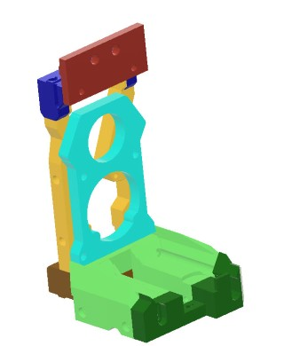

The head mount is based on using the modulardock From https://github.com/DraftShift/ModularDock 

Specifically using these Components
- FrameShort
- 2020

The rear components for the SV08 modular dock can be found in the stl's folder.

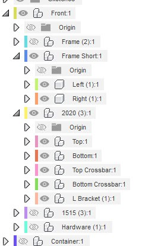

## Stealthchanger 

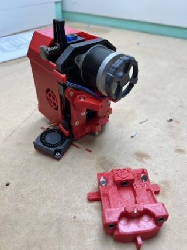

Follow the stealthchanger information found here - https://github.com/DraftShift/StealthChanger

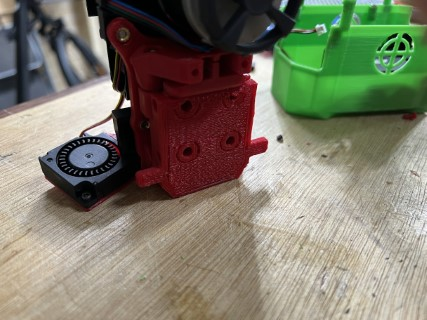
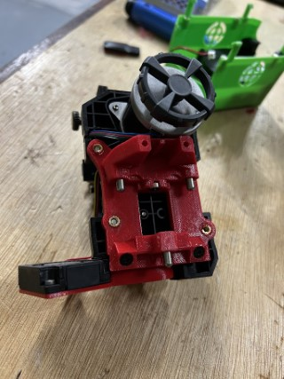
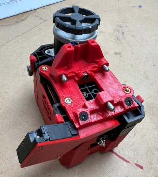
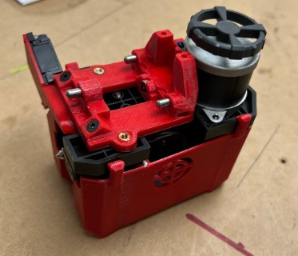
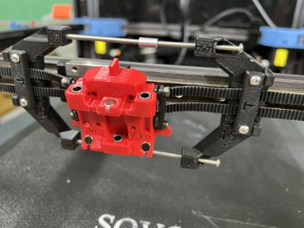
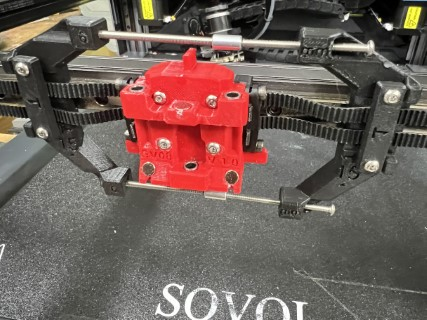

## Supports for docks

### Top 2020

The top 2020 extrusion has pre-built supports. Due to it's lenght and the small bolt holes, please ensure you compensate for any shrinkage when printing - size accuracy is key.

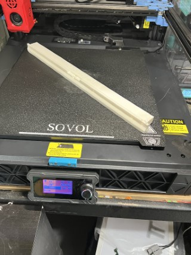

I've added a wave to the supports to try to assist with warping when printing in ABS/ASA

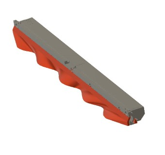

The print has supports built in, which will need snapping off after printing...

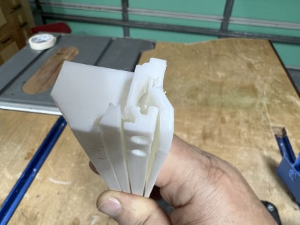

The light will need relocating (the screw holes can be used in attaching the 2020). I used some standard voron type tape to attach as shown.

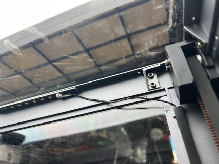

### Lower 2020

The bottom 2020 support pieces also have a hole printing guide. You MUST drill and tap, the bolt must NOT extend into the rear channel, since it would collide with the Z-Axis.

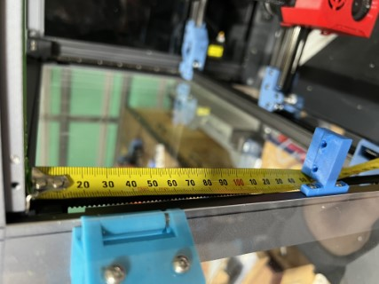

The head cover has built in supports for the clips, but may need manual supports on the front left/right indent area (depending on how well your bridging works.

Magnets - I've replaced the standard 4x3 magnets with 4x6 (or two 4x3) to increase pull strength.

## New power supply

I used this supply https://www.amazon.com.au/dp/B0CN1JVD4Y?ref=ppx_yo2ov_dt_b_fed_asin_title&th=1

And these mounts https://www.printables.com/model/1047201-sovol-sv08-power-supply-upgrade-mounting-parts

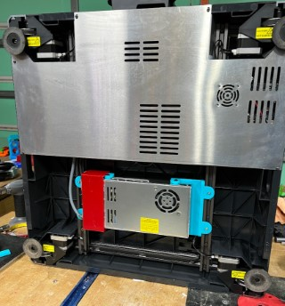

## Wiring General

I followed the method used by Teaching Tech (https://youtu.be/OFGBXBn_xqs?t=1077) using a birds-nest https://github.com/xbst/Birds-Nest here's a handy clip from Teaching-Tech's video.

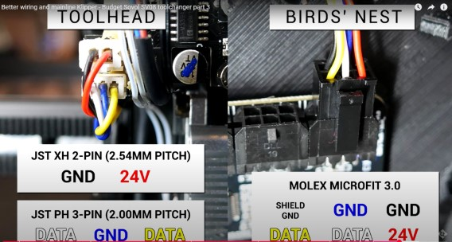

## Rear fan

The rear fan is moved to allow undocking of the head. Simply removed the fan and replace the mount with the new one. 

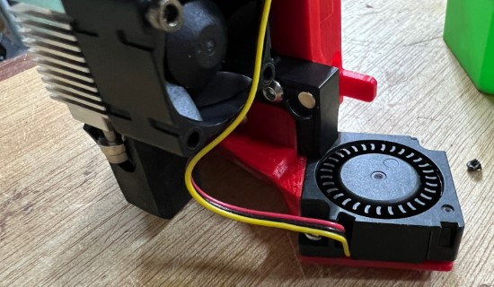

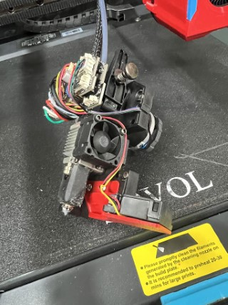

Note that this is fastened in the same holes, but from the front of the back plate rather than the back. 8mm M3 bolts will be needed.
To fasten the fan back on to the mount, either use the original bolts, or I have found using a 5mm M2.5 bolts gives a stronger fitting.

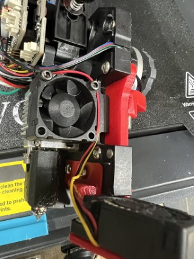

## Head cover

The design relies on this printed replacement head cover, which has additional rear clips, longer magnets, and 3 front magnets which attach to the dock. It also has additional cutouts to allow for the moved rear fan.

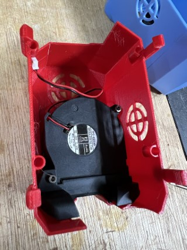

## Bed Raise

The SV08 stealthchanger mount moves the head up 15mm and slightly forward. It will require raising.

The bed shims require M4 thread inserts.

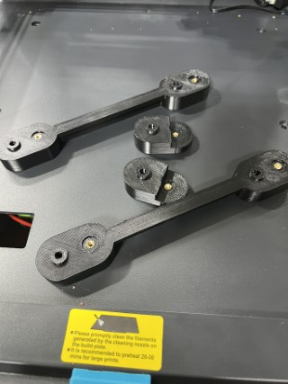

Remove the bed, insert the shims as below (it may be a tight fit) use the 6 original bed screws to fasten the shims. Use 6 new M4 screws to fasten down the bed in it's new position.
Re-wire the bed.

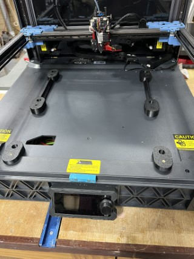
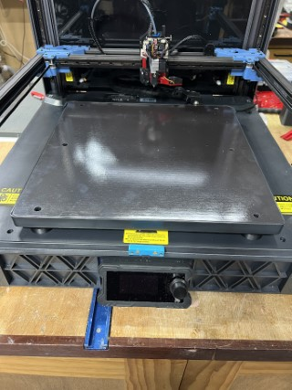

## Sexball / SexBolt

To allow for automated x-y-z calibration between the heads (https://github.com/viesturz/klipper-toolchanger/blob/main/tools_calibrate.md) I'm using a Sexball (https://github.com/DraftShift/StealthChanger/wiki/Bill-of-Materials#sexball-probe) which is based on the Sexbolt (https://mods.vorondesign.com/details/t1DBVlcUBbdEK6habEsVzg)

This allows the tools_calibrate macro (https://github.com/viesturz/klipper-toolchanger/blob/main/tools_calibrate.md) to be used to align all the heads.
	
	
## TOPHAT

Based from Nadir's top hat (https://www.printables.com/model/865851-sovol-sv08-top-hat), I designed a tall version with clear panels and a magnetic rear access cover for the cabling.

Here you see the tophat with all it's parts colour seperated. 

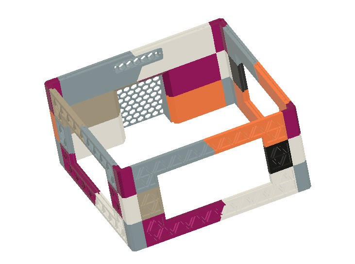
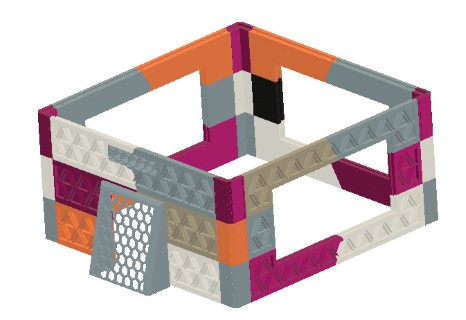

