# SOVOL SV08 Multihead Conversion

I've converted my SV08 to a multi-toolhead printer. I'm keeping the costs way down by using the standard SV08 toolheads.

This repo contains the files designs I've used for mounting on the SV08.

NOTE: Files may change as I continue to develop this project - please refer to the commit's to see what's changed.

For full build overview on a SV08, I suggest watching Teaching Tech's series on doing the conversion. At this time he's not yet finished, and hasn't published any of the cad work - hence me re-inventing the wheel in this design. 
[video link](https://www.youtube.com/watch?v=G6kc_BnYU8w&t=2s)

For an initial intro here's a quick video I did to show the mount. 
[video link](https://www.youtube.com/watch?v=clDU7j5NY64)

## ModularDock

The head mount is based on using the modulardock From 
[here](https://github.com/DraftShift/ModularDock)

Specifically using these Components
- FrameShort
- 2020

The rear components for the SV08 modular dock can be found in the stl's folder.

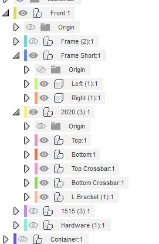

## *NEW* Modular dock - improved rest

I has now added a 2nd version of the dock components, implementing a better nozzle rest using a 5972k91 bearing (most common bearing used in many projects). This has been added to reduce nozzle 'dribble' whilst mounted. Two cut-down pen-springs are used to float the bearing.

The backplane stl is not needed with this version, as it's incorporated into the base itself.

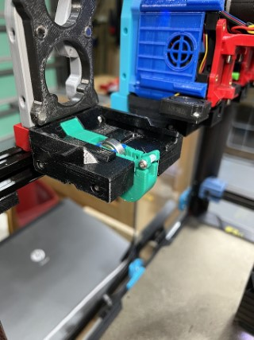
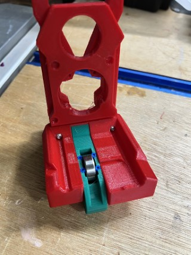
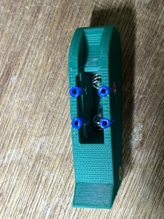
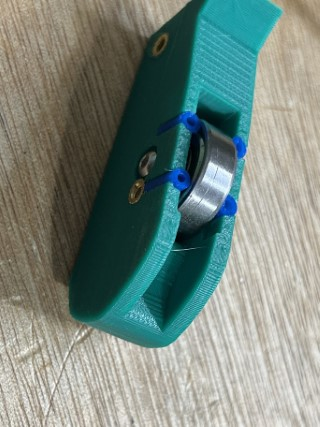

## Stealthchanger 

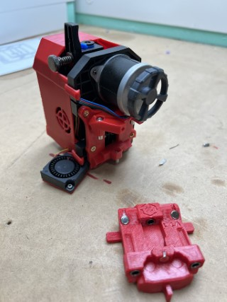

Follow the stealthchanger information found here - 
[link](https://github.com/DraftShift/StealthChanger)

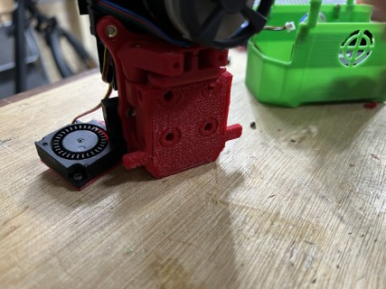
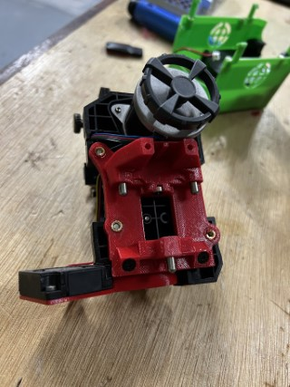
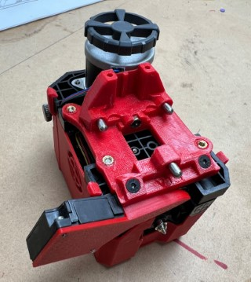
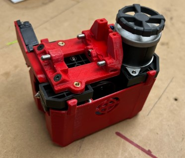
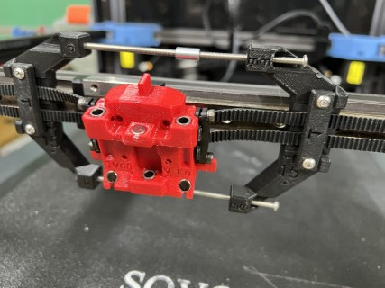
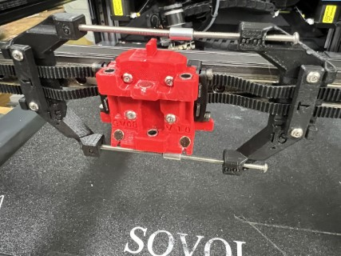

## Supports for docks

### Top 2020

The top 2020 extrusion has pre-built supports. Due to it's lenght and the small bolt holes, please ensure you compensate for any shrinkage when printing - size accuracy is key.

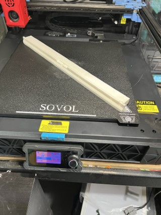

I've added a wave to the supports to try to assist with warping when printing in ABS/ASA

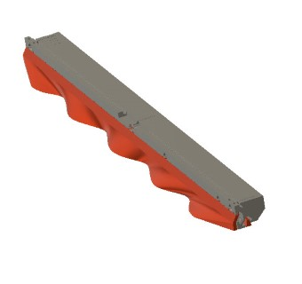

The print has supports built in, which will need snapping off after printing...

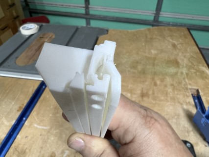

The light will need relocating (the screw holes can be used in attaching the 2020). I used some standard voron type tape to attach as shown.

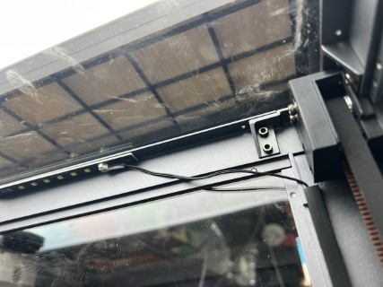

### Lower 2020

The bottom 2020 support pieces also have a hole printing guide. You MUST drill and tap, the bolt must NOT extend into the rear channel, since it would collide with the Z-Axis.

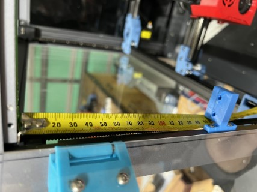

The head cover has built in supports for the clips, but may need manual supports on the front left/right indent area (depending on how well your bridging works.

Magnets - I've replaced the standard 4x3 magnets with 4x6 (or two 4x3) to increase pull strength.

## New power supply

I used this supply 
[supply link](https://www.amazon.com.au/dp/B0CN1JVD4Y?ref=ppx_yo2ov_dt_b_fed_asin_title&th=1)

And these mounts 
[mounts link](https://www.printables.com/model/1047201-sovol-sv08-power-supply-upgrade-mounting-parts)

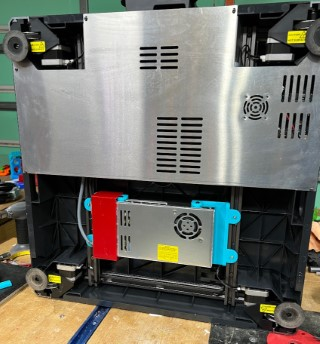

## Wiring General

I followed the method used by Teaching Tech 
[video link](https://youtu.be/OFGBXBn_xqs?t=1077)
using a birds-nest 
[birdsnest link](https://github.com/xbst/Birds-Nest)
 here's a handy clip from Teaching-Tech's video.
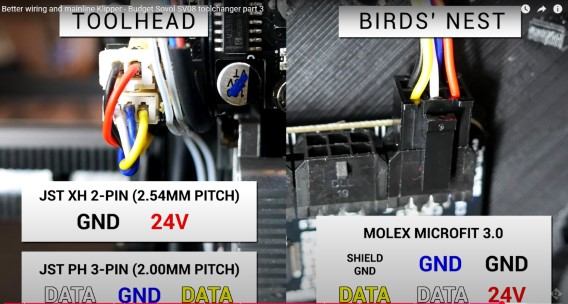

There's a simple birdnest attachment for the standard birdsnest fannypack_base that allows insertion of strain wires in the STL folder.
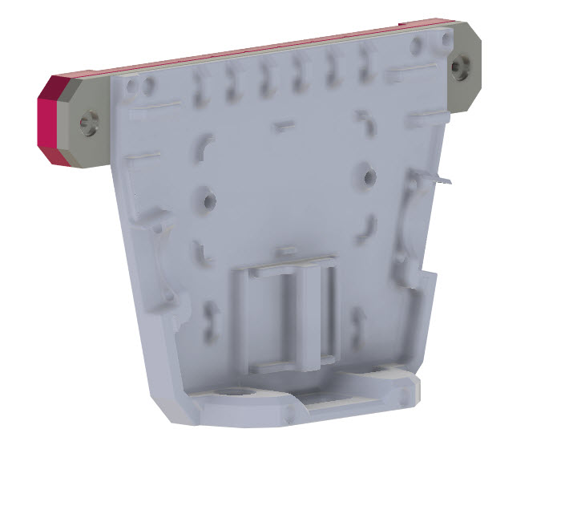
I bolted this to the rear of the SV08 - having drilled two small holes to bolt into.

## Rear fan

The rear fan is moved to allow undocking of the head. Simply removed the fan and replace the mount with the new one. 

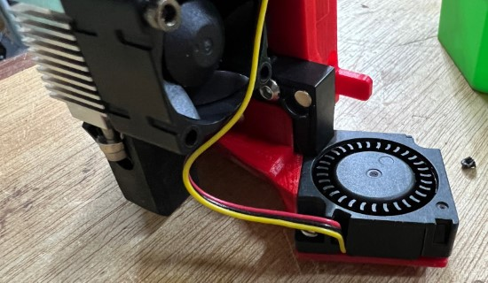

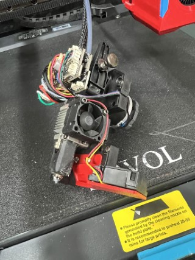

Note that this is fastened in the same holes, but from the front of the back plate rather than the back. 8mm M3 bolts will be needed.
To fasten the fan back on to the mount, either use the original bolts, or I have found using a 5mm M2.5 bolts gives a stronger fitting.

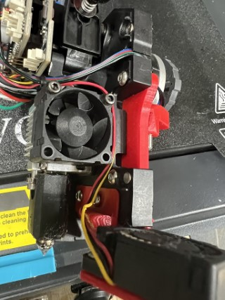

## Head cover

The design relies on this printed replacement head cover, which has additional rear clips, longer magnets, and 3 front magnets which attach to the dock. It also has additional cutouts to allow for the moved rear fan.

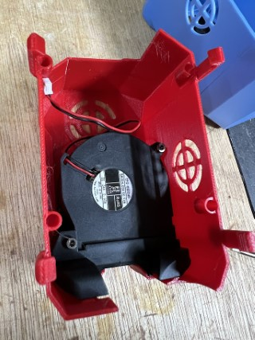

## Umbilical mount point

To ensure the hotend umbilical could be adjusted to avoid collisions. This extension to the standard wire mount adds a small extension into which the strengthening wire could be mounted.

Note: A small recess should be made into the head-cover to fit this mount point. (I'll change the head-cover design at some point).

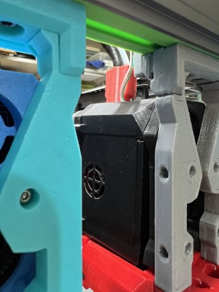
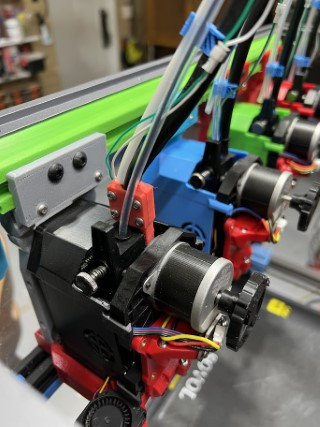
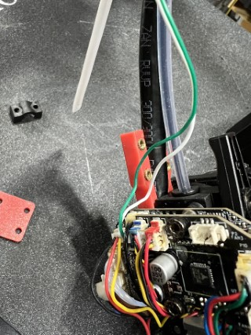

## Bed Raise

The SV08 stealthchanger mount moves the head up 15mm and slightly forward. It will require raising.

The bed shims require M4 thread inserts.

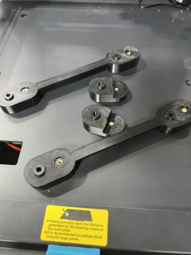

Remove the bed, insert the shims as below (it may be a tight fit) use the 6 original bed screws to fasten the shims. Use 6 new M4 screws to fasten down the bed in it's new position.
Re-wire the bed.

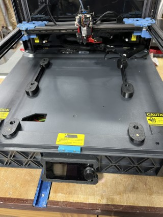
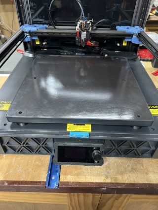

## Sexball / SexBolt

To allow for automated x-y-z calibration between the heads [see this](https://github.com/viesturz/klipper-toolchanger/blob/main/tools_calibrate.md) I'm using a Sexball [sexball](https://github.com/DraftShift/StealthChanger/wiki/Bill-of-Materials#sexball-probe) which is based on the Sexbolt [sexbolt](https://mods.vorondesign.com/details/t1DBVlcUBbdEK6habEsVzg)

I reduced the height of the ball by 4mm to make it closer to the bed, by cutting the bar (with an angle grinder). This isn't required, but I felt it looked better.

NOTE: The use of the sexball requires the bed moving forward an extra 5mm - versions of the shim STL's are marked for this change.

This allows the tools_calibrate macro [macros](https://github.com/viesturz/klipper-toolchanger/blob/main/tools_calibrate.md) to be used to align all the heads.
	
### TOOL ALIGNMENT

I found these instructions to be the easiest way to align.
[tool alignment](https://github.com/viesturz/NozzleAlign) - to get the offsets of the tools from the sexball 

Here's the command sequence I ran:
> T0\
> SET_HEATER_TEMPERATURE HEATER=extruder TARGET=200\
> G28\
> CLEAN_NOZZLE\
> MOVE_OVER_PROBE\
> TOOL_LOCATE_SENSOR     # Sensor location at 281.150000,354.818750,1.853125\
> SET_HEATER_TEMPERATURE HEATER=extruder TARGET=0\

-- At this point I check the location with that defined in calibration-offsets.cfg, if they are off, then correct them and restart.
 
 
> SET_HEATER_TEMPERATURE HEATER=extruder1 TARGET=200\
> T1                     # Note my load/unload does an auto CLEAN-NOZZLE each time\
> MOVE_OVER_PROBE\
> TOOL_CALIBRATE_TOOL_OFFSET           # T1 = Tool offset is -0.662500,-0.031250,-0.290625\
> SET_HEATER_TEMPERATURE HEATER=extruder1 TARGET=0\

Repeat the above for T2,3,4

_T1 = Tool offset is -0.662500,-0.031250,-0.290625_\
_T2 = Tool offset is -0.750000,0.300000,0.163125_\
_T3 = Tool offset is -1.106250,-0.531250,-0.165000_\
	
Finally to ensure the belts haven't slipped (eg docking errors) I recheck location of T0...

> SET_HEATER_TEMPERATURE HEATER=extruder TARGET=200\
> T0\
> MOVE_OVER_PROBE\
> TOOL_CALIBRATE_TOOL_OFFSET\
> SET_HEATER_TEMPERATURE HEATER=extruder TARGET=0\

_Final T0 = _Tool offset is -0.000000,-0.006250,0.037500_  :-) Close enough :-)_

## TOPHAT

Based from Nadir's top hat [tophat](https://www.printables.com/model/865851-sovol-sv08-top-hat), I designed a tall version with clear panels and a magnetic rear access cover for the cabling.

Here you see the tophat with all it's parts colour seperated. 

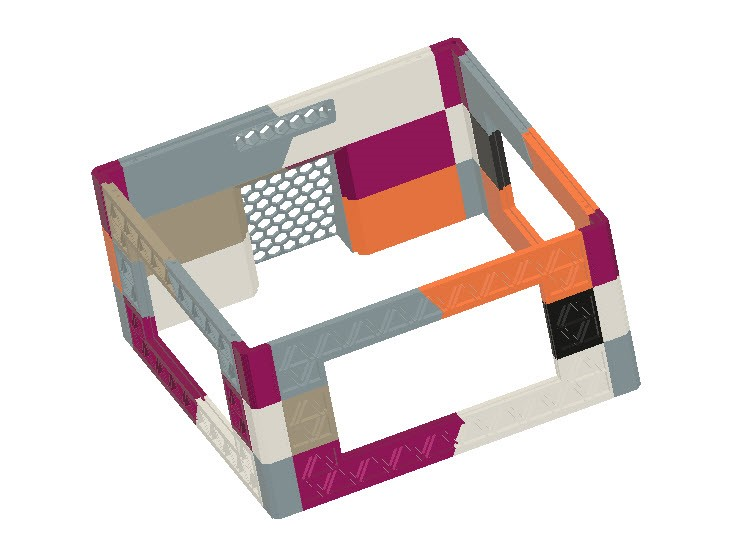
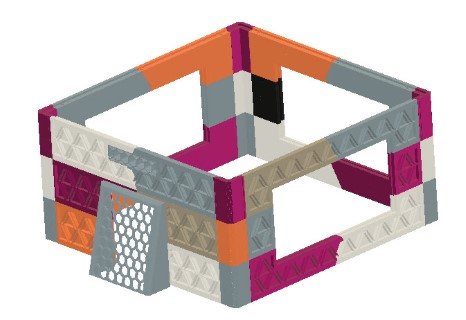

## RUNOUT DETECTOR

I've added a simple inline runout detector based on [this]https://www.printables.com/model/1084240-sovol-sv08-runout-sensor-on-head 
My version is here [my version]https://www.printables.com/model/1299711-generic-inline-runout-detector

Note it uses a 5.5mm ball (original used 5mm).

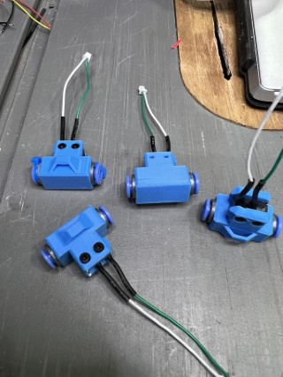

Here you can see the wiring for the DETECTOR

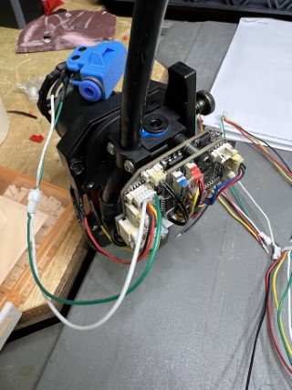

## REAR ROCKER

Here's a simple rocker to allow the SV08 to be moved to it's back without squashing any cables at the rear.

The bottom part can use the original bolts since they appear to have plenty of spare length.

The top two bolts (holding in the panels) need replacing with 8mm m3's

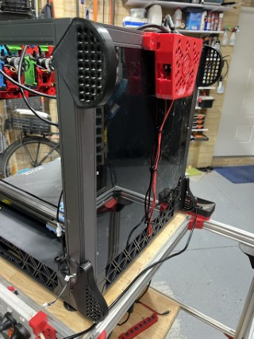
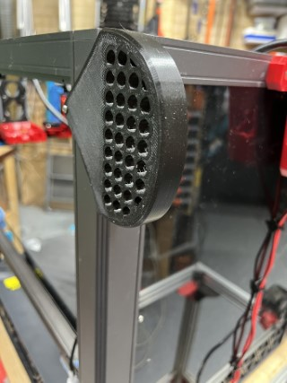
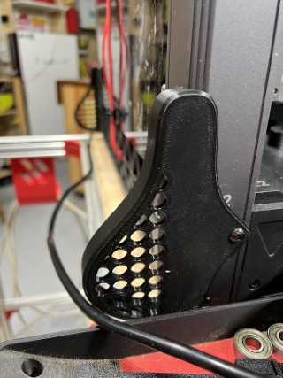

## BASE cover

Here's a simple cover to replace the stock metal one (still using the original fan) - I was not a fan of the original.

This will require a 36mm M3 bolt and an M3 2020 T-nut

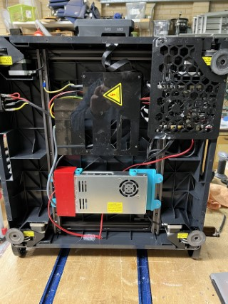

## Gantry Mounted wiper

I've created a modified version of [link] (https://www.printables.com/model/882364-new-version-adjustable-gantry-mounted-nozzle-seal) that has an extended and raised arm to fit this SV08 change. This can be seen in use in some of the videos.

## Final Klipper config files

My active klipper config files can all be found [here](https://github.com/robandwend/sv08-klipper)

# Over the top options...

As I've continued to tinker with this printer, I've made a few other modifications just for the fun of It

## Bambulab nozzle replacement.

I've used this converter to convert all nozzles to bambulabs. The original nozzles worked fine, but since all my other printers either use natively or have been converted to bambu nozzles, I thought I'd do this SV08 as well.

I've used both these converters
[link](https://www.printables.com/model/966176-remix-of-stephzics-sovol-sv08-bambu-lab-nozzle-ada)
[link](https://www.printables.com/model/944360-sovol-sv08-bambulab-clone-hotend-support)

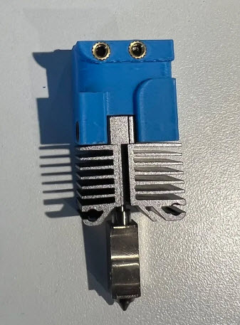
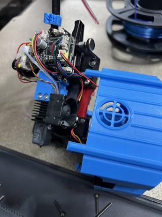

## Extra camera processing

I've moved all camera processing (including new ones listed below) to an additional Raspberry PI 4B (I had it spare).
This is  running crowsnest to publish the cameras. The original klipper config for the camera's now points their IP's to this additional processor.

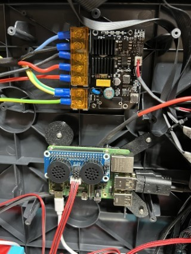

A mount for this PI is in /stls/extras/

## Nozzle Cam

I've used this nozzle cam (only currently on head0)
[link](https://www.mintion.net/products/mintion-nozzle-camera?variant=48352784122166)

STL's for the head mount and electronics box are in /stls/extras/

## Extra Camera's

In addition to the nozzle camera, I've added a camera to the rear top bar of the frame. 

This camera [link](https://www.aliexpress.com/item/1005005249688226.html)

Mount for the camera is in /stls/extras/

## Voice addition

Since I've now for the spare PI installed, I decided to add some speach to the printer.

I've added two small speakers (and a speaker pi-hat I had spare)...

The speakers were simply hot glued in place...

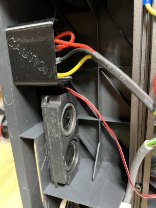
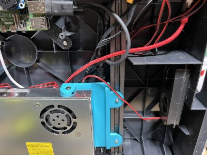

Text to speach is achieved using pipper (see this video 
[link](https://www.youtube.com/watch?v=rjq5eZoWWSo_)
 - although the installation method has changed somewhat since the video was made.
 
 Here's the location of piper [link](https://github.com/OHF-Voice/piper1-gpl)
 
 In short, the install command is
 - pip install piper-tts  --break-system-packages
 
 (Test without the break-system-packages option first, to see if it's required on your installation).
 
 To get my audio amplifier working I had to do the following (thanks chatgpt)...

Edit /boot/config.txt and add the line:

   dtoverlay=audremap,pins_18_19

and reboot

